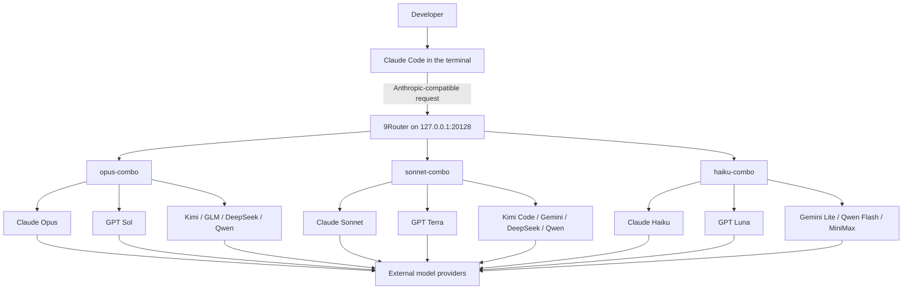

# Claude Code + 9Router Architecture and Multi-Model Combo Design Guide

> **Document purpose:** Explain a practical architecture for using Claude Code in the terminal, with 9Router acting as a local multi-provider gateway and three model chains serving the Opus, Sonnet, and Haiku roles.  
> This document is written for readers who have no prior knowledge of 9Router, Claude Code, or the reasons this combination was selected.

**Prepared:** August 5, 2026

---

## Table of Contents

1. [Executive Summary](#executive-summary)
2. [The Problem This Architecture Solves](#the-problem-this-architecture-solves)
3. [What Is 9Router?](#what-is-9router)
4. [What Is Claude Code?](#what-is-claude-code)
5. [Why Claude Code Terminal Was Chosen](#why-claude-code-terminal-was-chosen)
6. [Why OpenCode or Other Tools Were Not Chosen as the Primary Interface](#why-opencode-or-other-tools-were-not-chosen-as-the-primary-interface)
7. [Overall System Architecture](#overall-system-architecture)
8. [What Is a Combo in 9Router?](#what-is-a-combo-in-9router)
9. [The Opus, Sonnet, and Haiku Workload Tiers](#the-opus-sonnet-and-haiku-workload-tiers)
10. [Configuring Claude Code to Use 9Router](#configuring-claude-code-to-use-9router)
11. [Final Combo Definitions](#final-combo-definitions)
12. [Why These Models and This Ordering Were Selected](#why-these-models-and-this-ordering-were-selected)
13. [Models That Should Not Be Placed in Coding Combos](#models-that-should-not-be-placed-in-coding-combos)
14. [How Fallback Works in Practice](#how-fallback-works-in-practice)
15. [Benefits, Limitations, and Risks](#benefits-limitations-and-risks)
16. [Testing and Troubleshooting](#testing-and-troubleshooting)
17. [Maintenance Recommendations](#maintenance-recommendations)
18. [Conclusion](#conclusion)
19. [References](#references)

---

## Executive Summary

In this architecture, **Claude Code** is the primary user interface and coding agent. It runs in the terminal. Instead of connecting directly to one AI company or one model, Claude Code sends its requests to a local **9Router** endpoint:

```text
http://127.0.0.1:20128/v1
```

9Router receives the request, resolves the logical model name, and routes it to one of three Combos:

- `opus-combo`: for the most difficult architecture, reasoning, debugging, and refactoring tasks
- `sonnet-combo`: for most everyday software-development work
- `haiku-combo`: for lightweight, fast, low-cost, and background tasks

Each Combo is an ordered **fallback chain** containing multiple models and, where useful, multiple providers. If the preferred model or provider cannot be used because of depleted credit, rate limits, temporary failures, unavailable capacity, or authentication issues, 9Router can try the next eligible route.

The intended outcomes are:

- Less dependence on a single provider
- Fewer interruptions when a quota is exhausted or a provider is rate-limited
- Strong models for hard tasks and faster models for simple tasks
- Provider changes without changing the main Claude Code workflow
- A stable interface for the developer while the underlying model layer remains replaceable

---

## The Problem This Architecture Solves

Connecting a coding agent directly to one model or one provider creates several common problems:

1. A provider quota or account balance may be exhausted in the middle of a task.
2. A provider may become slow, unstable, or temporarily unavailable.
3. Using the most capable model for every request is normally expensive and slow.
4. Manually switching models and providers disrupts developer focus.
5. Different providers expose different API formats and conventions.
6. Models vary considerably in tool use, multi-file editing, and agentic coding quality.
7. A model may be excellent at deep reasoning but unnecessarily heavy for simple work.

This architecture separates responsibilities:

- **Claude Code** manages the agent loop, repository inspection, command execution, file editing, testing, and user interaction.
- **9Router** manages routing, format translation, provider selection, fallback behavior, usage logging, and credentials.
- **Combos** define the model-selection policy for each workload tier.

---

## What Is 9Router?

9Router is a **local AI gateway**. It sits between the coding tool and external model providers.

At a high level:

```text
Claude Code
    ↓
9Router running locally
    ↓
Anthropic / OpenAI / OpenRouter / Kimi / DeepSeek / Qwen / GLM / MiniMax / ...
```

According to the 9Router architecture documentation, the gateway provides an API-compatible endpoint and supports capabilities such as:

- Routing requests to multiple providers
- Translating requests and responses between API formats
- Falling back between multiple accounts for one provider
- Falling back between models in a Combo
- Refreshing tokens for supported providers
- Recording usage, cost, and request logs
- Managing providers and credentials through a Dashboard
- Keeping configuration locally, with optional synchronization features

### Important distinction

9Router is not itself a language model. Its role is closer to an **intelligent switchboard**:

- It receives a request.
- It finds an eligible route.
- It converts the request format when necessary.
- It returns the response in a format the originating tool understands.
- It tries an alternative route when an eligible failure occurs.

### Why local execution matters

In this setup, Claude Code connects to `127.0.0.1`, so the initial request enters a gateway running on the developer's own machine. However, the routed request may still be sent to an external provider.

Therefore:

> A locally hosted gateway does not mean the source code and prompts remain local throughout the entire request path.

Data-governance and provider-allowlist decisions are still necessary for confidential projects.

---

## What Is Claude Code?

Claude Code is a terminal-based coding agent. It can:

- Inspect a codebase and its structure
- Read and edit files
- Run shell commands
- Execute tests and builds
- Work with Git and other CLI tools
- Make coordinated changes across multiple files
- Use MCP, hooks, subagents, permissions, and sessions
- Run alongside the developer's existing IDE

Claude Code is more than a chat window for producing snippets. Its main value is the **agentic loop**: the model examines the project, chooses tools, runs actions, reads the results, and continues until the requested result is reached or user input is required.

---

## Why Claude Code Terminal Was Chosen

Selecting Claude Code does not imply that it is universally superior to every competing tool. It was selected because its architecture aligns particularly well with this setup.

### 1. Natural mapping to three model tiers

Claude Code recognizes logical model aliases such as:

- `opus`
- `sonnet`
- `haiku`
- `fable`

It also provides separate environment variables for these model families:

```text
ANTHROPIC_DEFAULT_OPUS_MODEL
ANTHROPIC_DEFAULT_SONNET_MODEL
ANTHROPIC_DEFAULT_HAIKU_MODEL
ANTHROPIC_DEFAULT_FABLE_MODEL
```

This maps cleanly to the three 9Router Combos:

```text
opus   → opus-combo
sonnet → sonnet-combo
haiku  → haiku-combo
```

That natural mapping is one of the strongest reasons for using Claude Code in this architecture.

### 2. Orchestration is separated from provider routing

Claude Code acts as the **coding agent and orchestrator**, while 9Router selects the actual model and provider.

This separation produces a clean architecture:

```text
Stable user interface and workflow: Claude Code
Replaceable routing layer:           9Router
Replaceable models and providers:    Combos
```

A provider can be added, removed, or reordered without replacing the developer's primary coding interface.

### 3. Deep terminal integration

A significant portion of software development occurs outside a text editor:

- Tests
- Builds
- Linters
- Git operations
- Docker
- Package managers
- Database migrations
- Deployment CLIs
- Log inspection
- Repository search and grep

Claude Code runs in the same terminal environment where these tools are available. With appropriate permissions, it can use them directly as part of its task loop.

### 4. IDE independence

Claude Code can run beside VS Code, JetBrains IDEs, Neovim, or another editor. The workflow is not tied to one IDE vendor or one extension ecosystem.

### 5. Agentic controls and project-level customization

Claude Code provides mechanisms such as:

- `CLAUDE.md` for project instructions and context
- Hooks for deterministic checks before or after actions
- Subagents for delegated work
- MCP for external tools and data sources
- Permission rules for commands and file modifications
- Session continuation and resume
- Checkpointing and change-recovery capabilities
- Headless and automation modes in supported scenarios

For professional use, the quality of the agent harness is often as important as the quality of the underlying model.

### 6. A consistent harness across providers

Using one agent shell keeps several behaviors more consistent:

- Prompt and tool-call structure
- Permission handling
- Project instructions
- Session management
- Command execution
- Review and approval workflow

Provider differences are handled behind the gateway instead of being exposed directly to the developer.

---

## Why OpenCode or Other Tools Were Not Chosen as the Primary Interface

### OpenCode is not a weak alternative

OpenCode is an open-source, terminal-based coding agent. Its documented capabilities include:

- Support for a large number of providers
- Support for local models
- A terminal user interface and `/connect` workflow
- Project initialization through `/init`
- Creation of an `AGENTS.md` project-instruction file
- Flexible model and provider selection

It is a capable tool and may be the better choice in other environments.

### Why it was not selected as the primary tool here

#### 1. Its provider abstraction would partially duplicate 9Router

One of OpenCode's major strengths is direct support for many providers. In this architecture, provider abstraction is already assigned to 9Router.

That creates some functional overlap:

```text
OpenCode provider abstraction
             and
9Router provider abstraction
```

The two tools can work together, and 9Router may also be used by OpenCode. However, this design intentionally assigns only one major role to each layer:

- Claude Code is the coding agent.
- 9Router is the provider and routing abstraction.

#### 2. The Opus/Sonnet/Haiku aliases fit this design unusually well

This project defines three workload classes. Claude Code exposes those same logical model roles directly, including a separate Haiku mapping used for lightweight and background behavior.

This makes the Combo architecture easy to explain and maintain.

#### 3. The goal was to preserve the Claude Code harness

The purpose of the setup was not to replace Claude Code. It was to keep its agentic workflow, permissions, project context, command execution, hooks, and surrounding ecosystem while reducing operational dependence on one model or provider.

In other words:

> The goal was not to replace Claude Code; the goal was to make Claude Code operationally independent from a single model route.

### When OpenCode may be the better choice

OpenCode may be preferable when:

- An open-source agent shell is the top priority.
- Direct multi-provider support is preferred over a separate gateway.
- Local-model execution is central to the workflow.
- The team prefers OpenCode's TUI and configuration model.
- The team does not want to adopt Claude Code conventions and aliases.

### Other tools

Tools such as Codex CLI, Gemini CLI, Cline, Continue, Cursor, and other coding agents may also be appropriate. The selection should be based on factors such as:

- Agent-loop quality
- Shell and repository access
- Permission model
- Model compatibility
- Controllability
- Tool-calling reliability
- Cost and quota
- Vendor lock-in
- IDE versus terminal requirements
- Team familiarity and ecosystem support

For this architecture, Claude Code was selected as the **front-end coding agent** and 9Router as the **back-end routing gateway**.

---

## Overall System Architecture



### Simplified request flow

1. The developer submits a task in Claude Code.
2. Claude Code selects a logical model role based on its current mode and internal behavior.
3. The corresponding environment variable maps that role to a 9Router Combo name.
4. The request is sent to 9Router.
5. 9Router resolves the Combo.
6. The first eligible model/provider route is attempted.
7. On success, the response is streamed back to Claude Code.
8. On an eligible failure, the next account or model route is attempted.
9. Usage and request status are recorded by 9Router.

---

## What Is a Combo in 9Router?

A Combo is a logical model name associated with an **ordered list of model routes**.

Example:

```text
sonnet-combo
├─ model 1
├─ model 2
├─ model 3
└─ model 4
```

The order matters. In a fallback chain, the first model is the preferred route and the remaining entries are alternatives.

### Two important fallback levels

9Router's architecture includes two relevant fallback layers.

#### Account-level fallback

If one provider has several accounts or credentials, 9Router may first try another eligible account for the same provider.

#### Combo-level fallback

If the current route is exhausted or returns a fallback-eligible failure, 9Router can move to the next model in the Combo.

### Not every error should trigger fallback

Fallback is generally useful for failures such as:

- Rate limits
- Exhausted quota or account balance
- Recoverable authentication issues
- Provider unavailability
- Temporary upstream errors

Errors caused by an invalid payload, an incompatible tool schema, or a malformed request may be returned immediately, because repeating the same invalid request against another model may not solve the problem.

### Routing strategy

For this use case, each Combo should use a **fallback-oriented strategy** rather than randomly distributing consecutive requests between models.

The objective is consistency:

- Prefer the best-matching model.
- Change models only when the preferred route is unavailable or unsuitable.
- Preserve behavior within a coding session as much as possible.

Round-robin or fusion-style strategies may be useful for other workloads, but they can introduce undesirable variability into a stateful coding-agent loop.

---

## The Opus, Sonnet, and Haiku Workload Tiers

The three Combos are not merely three different names. Each should be optimized for a different workload class.

### `opus-combo`

Best suited for:

- System and software architecture
- Large, multi-stage refactors
- Difficult debugging
- Complex dependency analysis
- Sensitive migrations
- Deep security analysis
- Long-running agentic tasks
- High-impact technical decisions

Desired characteristics:

- Maximum reasoning and coding quality
- Strong performance on long-horizon tasks
- Willingness to accept higher cost and latency
- Fallbacks from several strong model families

### `sonnet-combo`

Best suited for:

- The default coding model
- Feature implementation
- Bug fixing
- Test creation
- Code review
- Medium-size refactors
- Codebase explanation
- Everyday engineering work

Desired characteristics:

- A strong balance of quality, speed, and cost
- Reliable tool use
- Reasonable latency
- Coding-specialized fallback models

### `haiku-combo`

Best suited for:

- Fast repository search
- Summarization
- Simple classification
- Inspecting small files
- Short text generation
- Background functionality
- High-frequency invocations
- Low-risk subtasks

Desired characteristics:

- Low latency
- Low cost
- Direct and compact output
- Lightweight fallback models

---

## Configuring Claude Code to Use 9Router

Claude Code settings can be configured as follows:

```json
{
  "hasCompletedOnboarding": true,
  "env": {
    "ANTHROPIC_BASE_URL": "http://127.0.0.1:20128/v1",
    "ANTHROPIC_AUTH_TOKEN": "<9ROUTER_LOCAL_API_TOKEN>",
    "ANTHROPIC_DEFAULT_FABLE_MODEL": "cc/claude-fable-5",
    "ANTHROPIC_DEFAULT_OPUS_MODEL": "opus-combo",
    "ANTHROPIC_DEFAULT_SONNET_MODEL": "sonnet-combo",
    "ANTHROPIC_DEFAULT_HAIKU_MODEL": "haiku-combo"
  }
}
```

### Variable explanations

#### `ANTHROPIC_BASE_URL`

This changes Claude Code's default API endpoint to the local gateway:

```text
http://127.0.0.1:20128/v1
```

#### `ANTHROPIC_AUTH_TOKEN`

This is the authentication token used for the local 9Router gateway. Claude Code sends it using the expected bearer-token mechanism.

#### `ANTHROPIC_DEFAULT_OPUS_MODEL`

Maps Claude Code's logical Opus role to `opus-combo`.

#### `ANTHROPIC_DEFAULT_SONNET_MODEL`

Maps the logical Sonnet role to `sonnet-combo`.

#### `ANTHROPIC_DEFAULT_HAIKU_MODEL`

Maps the logical Haiku role, including applicable lightweight or background work, to `haiku-combo`.

#### `ANTHROPIC_DEFAULT_FABLE_MODEL`

Keeps the Fable mapping separate. In this setup, it points directly to a model rather than to a Combo.

### Security warning

A real token must not be:

- Included in public documentation
- Committed to Git
- Exposed in screenshots
- Sent in public chats
- Left inside a file intended for sharing

If a token is exposed, it should be revoked and rotated. Shared examples should always use a placeholder such as:

```text
<9ROUTER_LOCAL_API_TOKEN>
```

---

## Final Combo Definitions

The following ordering prioritizes protocol compatibility and quality, then provider diversity and emergency availability.

---

### `sonnet-combo`

```text
sonnet-combo
├─ 1. avalai/claude-sonnet-4-6
├─ 2. avalai/claude-sonnet-4-5
├─ 3. cx/gpt-5.6-terra
├─ 4. avalai/gpt-5.6-terra
├─ 5. avalai/kimi-k2.7-code-highspeed
├─ 6. avalai/gemini-3.6-flash
├─ 7. openrouter/deepseek/deepseek-v4-flash
├─ 8. avalai/deepseek-v4-flash
├─ 9. openrouter/qwen/qwen3.7-plus
└─ 10. avalai/qwen3.7-plus
```

JSON representation:

```json
{
  "name": "sonnet-combo",
  "models": [
    "avalai/claude-sonnet-4-6",
    "avalai/claude-sonnet-4-5",
    "cx/gpt-5.6-terra",
    "avalai/gpt-5.6-terra",
    "avalai/kimi-k2.7-code-highspeed",
    "avalai/gemini-3.6-flash",
    "openrouter/deepseek/deepseek-v4-flash",
    "avalai/deepseek-v4-flash",
    "openrouter/qwen/qwen3.7-plus",
    "avalai/qwen3.7-plus"
  ]
}
```

This Combo is intended to serve as the default everyday coding path.

---

### `opus-combo`

```text
opus-combo
├─ 1. avalai/claude-opus-5
├─ 2. avalai/claude-opus-4-8
├─ 3. cx/gpt-5.6-sol
├─ 4. avalai/gpt-5.6-sol
├─ 5. avalai/kimi-k3
├─ 6. avalai/glm-5.2
├─ 7. openrouter/deepseek/deepseek-v4-pro
├─ 8. avalai/deepseek-v4-pro
├─ 9. avalai/qwen/qwen3.8-max
└─ 10. kr/glm-5
```

JSON representation:

```json
{
  "name": "opus-combo",
  "models": [
    "avalai/claude-opus-5",
    "avalai/claude-opus-4-8",
    "cx/gpt-5.6-sol",
    "avalai/gpt-5.6-sol",
    "avalai/kimi-k3",
    "avalai/glm-5.2",
    "openrouter/deepseek/deepseek-v4-pro",
    "avalai/deepseek-v4-pro",
    "avalai/qwen/qwen3.8-max",
    "kr/glm-5"
  ]
}
```

`kr/glm-5` is treated as an emergency fallback. It can be removed if it creates excessive latency or has a materially lower success rate.

---

### `haiku-combo`

```text
haiku-combo
├─ 1. avalai/claude-haiku-4-5
├─ 2. cx/gpt-5.6-luna
├─ 3. avalai/gemini-3.5-flash-lite
├─ 4. openrouter/qwen/qwen3.7-flash
├─ 5. avalai/minimax-m2.7-highspeed
└─ 6. openrouter/minimax/MiniMax-M3
```

JSON representation:

```json
{
  "name": "haiku-combo",
  "models": [
    "avalai/claude-haiku-4-5",
    "cx/gpt-5.6-luna",
    "avalai/gemini-3.5-flash-lite",
    "openrouter/qwen/qwen3.7-flash",
    "avalai/minimax-m2.7-highspeed",
    "openrouter/minimax/MiniMax-M3"
  ]
}
```

The High-Speed MiniMax route is placed before MiniMax-M3 because low latency is normally more important than maximum reasoning capability for the Haiku role.

---

## Why These Models and This Ordering Were Selected

### 1. Claude models are placed first

Claude Code was originally designed around Claude's message protocol and behavior. Although 9Router can translate requests and responses between formats, Claude models generally provide the closest alignment with:

- Tool calling
- Message structure
- Thinking behavior
- Stop reasons
- Context conventions
- Claude Code's internal workflow expectations

For this reason, the corresponding Claude model is the preferred first route in each Combo.

### 2. The same model may appear through two providers

Some models appear twice through different provider routes:

```text
cx/gpt-5.6-terra
avalai/gpt-5.6-terra
```

or:

```text
openrouter/deepseek/deepseek-v4-pro
avalai/deepseek-v4-pro
```

This can improve resilience when:

- The underlying model is available through independent providers.
- One provider has exhausted quota or a service interruption.
- Geographic access or latency differs.
- Pricing or capacity differs.

However, duplicate entries only provide meaningful resilience if they represent genuinely independent routes. If both providers ultimately depend on the same backend or upstream capacity, the apparent diversity may not provide real fault isolation.

### 3. Model-family diversity is intentional

A strong Combo should not consist entirely of one model family. Diversifying families reduces the risk that a vendor-specific outage or behavior issue disables the entire chain.

For example, the Opus chain spans:

```text
Claude → GPT → Kimi → GLM → DeepSeek → Qwen
```

### 4. Kimi Code belongs in Sonnet rather than Haiku

`kimi-k2.7-code-highspeed` is included in Sonnet because it is intended for coding-agent work and is more capable than a lightweight background model. Its thinking behavior, tool-calling compatibility, and request requirements should be tested in the actual 9Router and Claude Code environment.

Some non-Claude models can impose special requirements on thinking parameters or request payloads. A model that works well in direct chat may still require adjustment when used inside Claude Code's agent loop.

### 5. Gemini Flash and Flash Lite serve different roles

The word `Flash` does not always mean that a model belongs in the lowest capability tier.

In this setup:

- `gemini-3.6-flash` is used as a balanced Sonnet fallback.
- `gemini-3.5-flash-lite` is used as a lightweight Haiku fallback.

### 6. DeepSeek Pro versus Flash

- The `pro` variant is placed in the high-capability Opus Combo.
- The `flash` variant is placed in the balanced Sonnet Combo.

### 7. MiniMax placement in Haiku

`minimax-m2.7-highspeed` is preferred for lower latency. `MiniMax-M3` remains available as the final, more capable fallback.

### 8. Provider ordering should eventually be driven by data

It is not possible to determine from the names `cx`, `avalai`, or `openrouter` alone which path will always perform best.

Duplicate provider ordering should be adjusted using real operational data:

- Success rate
- Time to first token
- Total response time
- Number of HTTP 429 responses
- Number of 5xx failures
- Tool-call validity
- Price
- Stability by time of day

---

## Models That Should Not Be Placed in Coding Combos

The original model list included many endpoints that are not general chat or coding models. Their presence in a provider's model catalog does not make them suitable for Claude Code.

The following categories should not be added to the Opus, Sonnet, or Haiku coding Combos merely because they appear in `/models`.

### Audio and text-to-speech models

Examples:

```text
eleven_*
tts-*
gpt-audio-*
playai-tts
```

### Transcription models

Examples:

```text
whisper-*
gpt-4o-transcribe*
scribe_*
```

### Embedding models

Examples:

```text
text-embedding-*
gemini-embedding-*
cohere.embed-*
```

### Reranking models

Examples:

```text
cohere-rerank-*
qwen3-rerank
semantic-ranker-*
```

### Image and video models

Examples:

```text
imagen-*
gpt-image-*
qwen-image*
flux-*
veo-*
sora-*
```

### OCR models

Examples:

```text
mistral-ocr-*
```

### Moderation and guard models

Examples:

```text
omni-moderation-*
llama-guard-*
prompt-guard-*
```

### Search tools or search endpoints

Examples:

```text
serper-search
tavily-search
perplexity-search
firecrawl-search
```

These endpoints may be useful elsewhere in an AI system, but they are not drop-in replacements for the general chat model expected by Claude Code.

---

## How Fallback Works in Practice

A hypothetical Sonnet request might proceed as follows:

```text
Claude Code requests sonnet-combo
        ↓
1. avalai/claude-sonnet-4-6
        ↓ HTTP 429 or quota exhausted
2. avalai/claude-sonnet-4-5
        ↓ provider unavailable
3. cx/gpt-5.6-terra
        ↓ success
Response returned to Claude Code
```

### Why fallback order matters

Fallback is not only about keeping the API available. Changing models can also change:

- Reasoning style
- Tool-call structure
- Response length
- Instruction following
- Context interpretation
- File-editing behavior
- Error recovery

Models that are closer in role and quality should therefore appear earlier. Emergency routes should appear later.

### Risks of an excessively long chain

A long chain can improve availability, but it also creates disadvantages:

- Final errors take longer to surface.
- Troubleshooting becomes harder.
- A late fallback may not meet the quality expectations of the role.
- Invalid requests may be repeated unnecessarily.
- A long session may exhibit inconsistent behavior after a model switch.

For many environments, five to ten routes per Combo are enough. The correct number should be determined using real telemetry rather than a fixed rule.

---

## Benefits, Limitations, and Risks

### Benefits

#### Improved resilience

Exhausting one provider's quota does not necessarily end the coding session.

#### Cost control

Lightweight tasks can use faster, cheaper models while expensive models are reserved for difficult work.

#### Provider independence

The coding agent connects to one stable endpoint while providers can change behind the gateway.

#### Easier experimentation

A new model or provider can be added near the end of a Combo and evaluated without replacing the primary tool.

#### Stable developer workflow

The developer continues using Claude Code rather than learning a different interface for every provider.

#### Observability

9Router can record request and usage information that can be used to improve Combo ordering.

### Limitations and risks

#### Format translation is not always perfect

Non-Claude models may not implement the same protocol semantics or behavior as Claude models.

#### Successful HTTP fallback does not guarantee equal quality

A route may return a technically successful response while producing lower-quality edits or reasoning.

#### Tool-calling incompatibility

A model may write good prose but perform poorly with:

- Function calling
- JSON Schema
- Parallel tools
- Stop reasons
- Streaming tool input

#### Different context windows

Claude Code may make assumptions based on a model name or configuration. Context capacity and actual provider limits should be verified for every route.

#### Credential security

9Router manages provider secrets. Its local configuration files, database, and logs should be protected with appropriate filesystem permissions.

#### Source code may be sent to multiple providers

Fallback may result in project content or prompts being sent to different companies. Confidential projects require a clear provider allowlist and data-handling policy.

#### Model switching within one session

If a long session falls back to a substantially different model, continuity, style, and decision quality may change.

#### Gateway dependency

If the local 9Router process stops, all providers behind it become unavailable to Claude Code. The local process and port therefore become part of the critical path.

#### Hidden common-mode failures

Two provider labels may still share the same upstream infrastructure. Provider diversity should be verified rather than assumed.

---

## Testing and Troubleshooting

### 1. Confirm that 9Router is running

Verify that the service is listening on:

```text
127.0.0.1:20128
```

### 2. Confirm the endpoint configuration

Claude Code must point to the endpoint exposed by 9Router:

```json
"ANTHROPIC_BASE_URL": "http://127.0.0.1:20128/v1"
```

### 3. Verify Combo names exactly

The Combo names must match the environment variables exactly:

```text
opus-combo
sonnet-combo
haiku-combo
```

A difference in capitalization, punctuation, or suffixes can cause a model-resolution error.

### 4. Verify the local token

The token should:

- Be active
- Belong to the correct 9Router instance
- Match the expected bearer-auth behavior
- Contain no accidental whitespace or quoting errors

### 5. Test every Combo independently

Use tasks appropriate for each role.

#### Haiku test tasks

- Summarize a small file
- Locate several function names
- Give a brief overview of the project structure

#### Sonnet test tasks

- Fix a medium-complexity bug
- Write unit tests
- Implement a small feature across several files

#### Opus test tasks

- Design a migration
- Analyze a race condition
- Refactor several modules
- Produce an architectural design with trade-offs

### 6. Perform a controlled fallback test

To verify fallback behavior:

1. Temporarily disable one non-critical test provider.
2. Send a request to the relevant Combo.
3. Inspect the logs to confirm that the next route was attempted.
4. Re-enable the provider.

Do not perform this test on a sensitive production workflow.

### 7. Inspect logs and usage data

Review information such as:

- Selected provider
- Actual model route
- HTTP status code
- Retry count
- Latency
- Prompt tokens
- Output tokens
- Error details
- Fallback sequence

Depending on the 9Router version and configuration, operational data may be available in the Dashboard, `usage.json`, `log.txt`, and a deeper `logs/` directory.

### 8. Common errors

#### `connection refused`

9Router is probably not running, is listening on another port, or is blocked locally.

#### HTTP `401` or `403`

The local gateway token or an upstream provider credential may be invalid.

#### `model not found`

The Combo name or model ID does not exactly match the configured value.

#### HTTP `429`

The current route has hit a quota or rate limit. Inspect whether fallback occurred and whether the failure was classified as fallback-eligible.

#### Invalid tool call

The selected fallback model may not be fully compatible with Claude Code's tool schema or protocol behavior.

#### Excessive latency

The Combo may be too long, or several failing routes may be attempted before a successful one.

#### Unexpectedly weak edits

A late fallback may have succeeded technically but may not belong in that workload tier. Move it later, remove it, or place it in a separate emergency Combo.

---

## Maintenance Recommendations

### 1. Do not treat Combo order as permanent

Review provider and model ordering every two to four weeks, or after a material provider/model change.

### 2. Prefer versioned model IDs for sensitive workflows

A dated or versioned model ID is usually more predictable than a moving alias such as `latest`.

### 3. Do not keep a weak route only because it is free

A free fallback that produces invalid tool calls or harmful edits may create more engineering cost than it saves.

### 4. Define operational success metrics

Track at least:

```text
Success rate
Tool-call validity
Time to first token
Total latency
Average cost
Retry rate
HTTP 429 rate
HTTP 5xx rate
Task-completion quality
```

### 5. Preserve workload separation

Do not put an unnecessarily heavy model near the start of Haiku. Do not put an undersized model near the start of Opus.

### 6. Record configuration changes

For each Combo change, record:

- Date
- Added or removed model
- Provider
- Reason for the change
- Benchmark or incident evidence
- Rollback plan

### 7. Rotate secrets

Exposed tokens should be revoked promptly. Shared configuration files must not contain real secrets.

### 8. Create an allowlist for confidential repositories

Not every provider should automatically be allowed to receive proprietary source code. Create separate Combos containing only approved providers for sensitive projects.

### 9. Benchmark non-Claude models before relying on them

At minimum, test:

- Multi-file editing
- Shell usage
- Test execution
- Recovery after command failure
- JSON and tool-schema validity
- Instruction retention
- Avoidance of out-of-scope changes

### 10. Watch for apparent versus real provider diversity

Confirm whether duplicate routes are actually independent. Shared upstream capacity, shared resellers, or common regional infrastructure may defeat the intended redundancy.

### 11. Keep an emergency minimal configuration

Maintain a small known-good Combo or direct route for troubleshooting. This helps determine whether a problem comes from:

- Claude Code
- 9Router
- A Combo definition
- One provider
- One model's protocol behavior

### 12. Test after model updates

Even when the model ID remains similar, an upstream update can change:

- Tool-call behavior
- Latency
- Output verbosity
- Context handling
- Instruction following
- Safety filtering

Re-run a small regression suite after material provider or model changes.

---

## Conclusion

This architecture has three clear layers:

```text
Claude Code = coding agent and developer interface
9Router     = local gateway, translator, and fallback manager
Combos      = model and provider selection policy
```

Claude Code was selected because:

- It works directly in the terminal beside the rest of the development toolchain.
- It provides a mature agentic workflow.
- Its Opus, Sonnet, and Haiku aliases map directly to the three workload Combos.
- It combines permissions, hooks, subagents, MCP, and project context in one harness.
- The underlying model and provider can be changed without replacing the developer experience.

OpenCode remains a valid and powerful alternative, particularly for teams that prioritize an open-source agent shell, direct multi-provider integration, or local-model use. In this setup, however, provider abstraction is already handled by 9Router, and the primary objective is to preserve the Claude Code workflow while adding multi-model routing and fallback.

The final Combo design follows these principles:

- **Opus:** maximum reasoning and coding quality
- **Sonnet:** balanced quality, speed, and cost
- **Haiku:** low latency and low cost for lightweight work
- **Fallback:** diversity across models and providers to reduce interruption
- **Security:** no real tokens in shared documentation and explicit control over approved providers
- **Continuous optimization:** ordering based on logs, benchmarks, and actual task outcomes

This setup should not be treated as a permanent, static configuration. Models, quotas, provider reliability, pricing, and protocol compatibility change over time. The best Combo is the one maintained using the team's own telemetry and regression tests.

---

## References

### 9Router

- Official 9Router repository:  
  https://github.com/decolua/9router
- 9Router architecture documentation:  
  https://github.com/decolua/9router/blob/master/docs/ARCHITECTURE.md
- 9Router website:  
  https://9router.com/

### Claude Code

- Official Claude Code product page:  
  https://claude.com/product/claude-code
- Model configuration documentation:  
  https://code.claude.com/docs/en/model-config
- Environment variable documentation:  
  https://code.claude.com/docs/en/env-vars
- Agent SDK and agentic capabilities:  
  https://code.claude.com/docs/en/agent-sdk/overview

### OpenCode

- Official OpenCode documentation:  
  https://opencode.ai/docs/
- OpenCode provider documentation:  
  https://opencode.ai/docs/providers/

---

## Appendix: Handoff Checklist

- [ ] 9Router is installed and running.
- [ ] The 9Router Dashboard is accessible.
- [ ] Providers and credentials have been tested.
- [ ] The three Combos have been created with their exact names.
- [ ] Model order has been reviewed.
- [ ] The routing strategy is configured for fallback behavior.
- [ ] Claude Code is installed.
- [ ] `ANTHROPIC_BASE_URL` points to the local gateway.
- [ ] The real `ANTHROPIC_AUTH_TOKEN` is stored only in a secure location.
- [ ] Opus, Sonnet, and Haiku aliases are mapped to their respective Combos.
- [ ] Each Combo has been tested independently.
- [ ] Controlled fallback has been tested.
- [ ] Logs and usage records have been reviewed.
- [ ] Approved providers for confidential code have been defined.
- [ ] No real secret appears in documentation or Git.
- [ ] A small regression suite exists for future model and provider changes.
