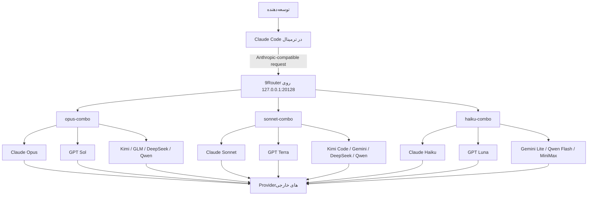

# راهنمای معماری Claude Code + 9Router و طراحی Comboهای چندمدلی

> **هدف سند:** توضیح یک معماری عملی برای استفاده از Claude Code در ترمینال، با 9Router به‌عنوان درگاه محلی چندارائه‌دهنده‌ای و سه زنجیره‌ی مدل با نقش‌های Opus، Sonnet و Haiku.  
> این متن برای خواننده‌ای نوشته شده که پیش‌زمینه‌ای درباره‌ی 9Router، Claude Code یا دلیل انتخاب این ترکیب ندارد.

**تاریخ تهیه:** ۵ اوت ۲۰۲۶

---

## فهرست مطالب

1. [خلاصه‌ی اجرایی](#خلاصه‌ی-اجرایی)
2. [مسئله‌ای که این معماری حل می‌کند](#مسئله‌ای-که-این-معماری-حل-می‌کند)
3. [9Router چیست؟](#9router-چیست)
4. [Claude Code چیست؟](#claude-code-چیست)
5. [چرا Claude Code Terminal انتخاب شد؟](#چرا-claude-code-terminal-انتخاب-شد)
6. [چرا OpenCode یا ابزارهای دیگر انتخاب اصلی نشدند؟](#چرا-opencode-یا-ابزارهای-دیگر-انتخاب-اصلی-نشدند)
7. [معماری کلی سیستم](#معماری-کلی-سیستم)
8. [Combo در 9Router چیست؟](#combo-در-9router-چیست)
9. [منطق سه سطح Opus، Sonnet و Haiku](#منطق-سه-سطح-opus-sonnet-و-haiku)
10. [تنظیم Claude Code برای اتصال به 9Router](#تنظیم-claude-code-برای-اتصال-به-9router)
11. [Comboهای نهایی](#comboهای-نهایی)
12. [دلیل انتخاب و ترتیب مدل‌ها](#دلیل-انتخاب-و-ترتیب-مدل‌ها)
13. [مدل‌هایی که نباید داخل Comboهای کدنویسی قرار گیرند](#مدل‌هایی-که-نباید-داخل-comboهای-کدنویسی-قرار-گیرند)
14. [رفتار Fallback در عمل](#رفتار-fallback-در-عمل)
15. [مزایا، محدودیت‌ها و ریسک‌ها](#مزایا-محدودیت‌ها-و-ریسک‌ها)
16. [روش تست و عیب‌یابی](#روش-تست-و-عیب‌یابی)
17. [پیشنهادهای نگهداری](#پیشنهادهای-نگهداری)
18. [جمع‌بندی](#جمع‌بندی)
19. [منابع](#منابع)

---

## خلاصه‌ی اجرایی

در این معماری، **Claude Code** رابط اصلی کاربر و عامل کدنویسی است و در ترمینال اجرا می‌شود. Claude Code به‌جای اتصال مستقیم به یک شرکت یا یک مدل مشخص، درخواست‌هایش را به یک آدرس محلی در **9Router** می‌فرستد:

```text
http://127.0.0.1:20128/v1
```

9Router درخواست را دریافت می‌کند، نام مدل منطقی را تشخیص می‌دهد و آن را به یکی از سه Combo زیر می‌فرستد:

- `opus-combo`: برای سخت‌ترین کارهای معماری، reasoning، debugging و refactor
- `sonnet-combo`: برای بیشتر کارهای روزمره‌ی توسعه
- `haiku-combo`: برای کارهای سبک، سریع، کم‌هزینه و فعالیت‌های پس‌زمینه

هر Combo یک **زنجیره‌ی fallback** از چند مدل و چند provider است. اگر مدل یا provider اول به‌علت محدودیت اعتبار، rate limit، خطای موقت، نبود دسترسی یا مشکل احراز هویت قابل استفاده نباشد، 9Router می‌تواند مسیر بعدی را امتحان کند.

نتیجه‌ی مورد انتظار:

- وابستگی کمتر به یک provider
- توقف کمتر در زمان تمام‌شدن quota یا بروز rate limit
- استفاده از مدل‌های قوی برای کارهای سخت و مدل‌های سریع‌تر برای کارهای ساده
- امکان جابه‌جایی provider بدون تغییر دادن workflow اصلی Claude Code
- حفظ یک رابط ثابت برای توسعه‌دهنده، در حالی که لایه‌ی مدل‌ها در پشت صحنه تغییر می‌کند

---

## مسئله‌ای که این معماری حل می‌کند

استفاده‌ی مستقیم از یک مدل یا یک provider چند مشکل رایج دارد:

1. ممکن است quota یا اعتبار سرویس در میانه‌ی کار تمام شود.
2. یک provider ممکن است کند، ناپایدار یا موقتاً unavailable شود.
3. استفاده از قوی‌ترین مدل برای تمام درخواست‌ها معمولاً گران و کند است.
4. تغییر دستی مدل و provider تمرکز توسعه‌دهنده را از بین می‌برد.
5. ابزارهای مختلف قالب‌های API متفاوتی دارند.
6. کیفیت همه‌ی مدل‌ها برای tool use، ویرایش چندفایلی و agentic coding یکسان نیست.
7. ممکن است یک مدل در reasoning عالی باشد ولی برای کارهای ساده بیش‌ازحد سنگین باشد.

این معماری مسئولیت‌ها را جدا می‌کند:

- **Claude Code** مسئول agent loop، خواندن پروژه، اجرای command، ویرایش فایل، تست و تعامل با توسعه‌دهنده است.
- **9Router** مسئول مسیریابی، ترجمه‌ی قالب‌ها، انتخاب provider، fallback، ثبت usage و مدیریت credentialها است.
- **Comboها** سیاست انتخاب مدل را تعریف می‌کنند.

---

## 9Router چیست؟

9Router یک **درگاه محلی AI** یا Local AI Gateway است. این نرم‌افزار بین ابزار کدنویسی و providerهای مدل قرار می‌گیرد.

به‌صورت ساده:

```text
Claude Code
    ↓
9Router روی سیستم محلی
    ↓
Anthropic / OpenAI / OpenRouter / Kimi / DeepSeek / Qwen / GLM / MiniMax / ...
```

طبق مستندات معماری 9Router، این ابزار یک endpoint سازگار با API ارائه می‌کند و قابلیت‌های زیر را دارد:

- مسیریابی درخواست‌ها به چند provider
- ترجمه‌ی request و response میان قالب‌های مختلف
- fallback میان حساب‌های یک provider
- fallback میان مدل‌های یک Combo
- refresh کردن token در providerهای پشتیبانی‌شده
- ثبت usage، هزینه و log درخواست‌ها
- مدیریت providerها و credentialها از طریق Dashboard
- نگهداری تنظیمات به‌صورت محلی، با امکان sync اختیاری

### نکته‌ی مهم

9Router خودش مدل زبانی نیست. نقش آن شبیه یک **سوئیچ‌برد هوشمند** است:

- درخواست را دریافت می‌کند.
- مسیر مناسب را پیدا می‌کند.
- قالب درخواست را در صورت نیاز تبدیل می‌کند.
- پاسخ را به فرمتی که ابزار مبدا می‌فهمد برمی‌گرداند.
- در صورت خطای واجد شرایط، مسیر جایگزین را امتحان می‌کند.

### چرا اجرای محلی مهم است؟

در این setup، Claude Code به `127.0.0.1` متصل می‌شود. یعنی نقطه‌ی ورود درخواست‌ها روی همان سیستم توسعه‌دهنده است. بااین‌حال، خود درخواست پس از مسیریابی همچنان می‌تواند به provider خارجی ارسال شود؛ بنابراین «محلی بودن Gateway» به معنی «محلی ماندن کد و داده در تمام مسیر» نیست.

---

## Claude Code چیست؟

Claude Code یک عامل کدنویسی است که در ترمینال اجرا می‌شود و می‌تواند:

- ساختار codebase را بررسی کند
- فایل‌ها را بخواند و ویرایش کند
- commandهای shell را اجرا کند
- تست‌ها و build را اجرا کند
- با Git و سایر CLI toolها کار کند
- تغییرات چندفایلی انجام دهد
- از MCP، hooks، subagents، permissions و sessionها استفاده کند
- در کنار IDE فعلی توسعه‌دهنده اجرا شود

Claude Code فقط یک پنجره‌ی chat برای تولید snippet نیست. ارزش اصلی آن در **agentic loop** است: مدل وضعیت پروژه را بررسی می‌کند، ابزار مناسب را اجرا می‌کند، نتیجه را می‌خواند و تا رسیدن به خروجی قابل‌قبول مراحل را ادامه می‌دهد.

---

## چرا Claude Code Terminal انتخاب شد؟

انتخاب Claude Code در این معماری به معنی برتری مطلق آن نسبت به تمام ابزارها نیست. این انتخاب به دلیل تطابق خوب آن با نیازهای این setup انجام شده است.

### ۱. نگاشت طبیعی سه سطح مدل

Claude Code به‌صورت رسمی aliasهای مدل مانند موارد زیر را می‌شناسد:

- `opus`
- `sonnet`
- `haiku`
- `fable`

و برای هر خانواده environment variable مستقل دارد:

```text
ANTHROPIC_DEFAULT_OPUS_MODEL
ANTHROPIC_DEFAULT_SONNET_MODEL
ANTHROPIC_DEFAULT_HAIKU_MODEL
ANTHROPIC_DEFAULT_FABLE_MODEL
```

این ساختار دقیقاً با سه Combo طراحی‌شده هماهنگ است. در نتیجه می‌توان نقش‌های داخلی Claude Code را بدون تغییر workflow به Comboهای 9Router نگاشت کرد:

```text
opus  → opus-combo
sonnet → sonnet-combo
haiku → haiku-combo
```

این تطابق یکی از مهم‌ترین دلایل انتخاب Claude Code است.

### ۲. مدل orchestration از لایه‌ی provider جدا می‌شود

در این معماری Claude Code نقش **عامل یا orchestrator** را دارد، ولی انتخاب مدل واقعی به 9Router سپرده شده است.

این جداسازی مزیت مهمی دارد:

```text
رابط و workflow ثابت: Claude Code
لایه‌ی routing قابل‌تغییر: 9Router
مدل و provider قابل‌تعویض: Comboها
```

بنابراین برای اضافه‌کردن provider، تغییر ترتیب fallback یا جایگزینی یک مدل، لازم نیست ابزار اصلی توسعه تغییر کند.

### ۳. ادغام عمیق با ترمینال

بخش مهم توسعه‌ی نرم‌افزار خارج از editor اتفاق می‌افتد:

- اجرای تست
- build
- lint
- Git
- Docker
- package manager
- migration دیتابیس
- deployment CLI
- بررسی log
- grep و جست‌وجوی repository

Claude Code در همان محیطی اجرا می‌شود که این ابزارها در دسترس‌اند و می‌تواند با permission مناسب از آن‌ها استفاده کند.

### ۴. مستقل از IDE

Claude Code در ترمینال اجرا می‌شود و می‌تواند در کنار VS Code، JetBrains، Neovim یا هر IDE دیگری استفاده شود. این موضوع از وابستگی workflow به یک editor خاص جلوگیری می‌کند.

### ۵. امکانات agentic و کنترل‌پذیری

Claude Code سازوکارهایی مانند موارد زیر دارد:

- `CLAUDE.md` برای دستورالعمل و context پروژه
- hooks برای اجرای کنترل‌های قطعی قبل یا بعد از actionها
- subagents برای تقسیم وظایف
- MCP برای اتصال به ابزارها و منابع خارجی
- permissions برای کنترل command و ویرایش
- session و resume
- checkpointing و قابلیت‌های مرتبط با بازگشت تغییرات
- headless/automation در سناریوهای پشتیبانی‌شده

برای یک workflow حرفه‌ای، کیفیت harness و ابزارهای اطراف مدل به‌اندازه‌ی خود مدل مهم است.

### ۶. رفتار پایدارتر برای یک workflow واحد

استفاده از یک agent shell ثابت باعث می‌شود:

- شکل prompt و tool callها ثابت‌تر بماند.
- permissionها و policyها یک‌جا مدیریت شوند.
- تفاوت providerها در لایه‌ی 9Router جذب شود.
- توسعه‌دهنده مجبور نباشد برای هر مدل ابزار متفاوتی یاد بگیرد.

---

## چرا OpenCode یا ابزارهای دیگر انتخاب اصلی نشدند؟

### ابتدا: OpenCode ابزار ضعیفی نیست

OpenCode یک عامل کدنویسی متن‌باز و terminal-based است. طبق مستندات رسمی آن:

- از بیش از ۷۵ provider پشتیبانی می‌کند.
- امکان استفاده از مدل‌های local را دارد.
- از TUI و دستور `/connect` استفاده می‌کند.
- می‌تواند با `/init` پروژه را تحلیل و فایل `AGENTS.md` ایجاد کند.
- برای انتخاب آزادانه‌ی providerها گزینه‌ی قدرتمندی است.

بنابراین هدف این سند رد کردن OpenCode نیست.

### دلیل انتخاب نشدن OpenCode به‌عنوان ابزار اصلی در این setup

#### ۱. قابلیت اصلی OpenCode در این معماری تا حدی تکراری می‌شود

یکی از مزیت‌های بزرگ OpenCode، پشتیبانی مستقیم از providerهای متعدد است. اما در این معماری، این وظیفه از قبل به 9Router سپرده شده است.

یعنی:

```text
OpenCode provider abstraction
            و
9Router provider abstraction
```

تا حدی نقش مشابهی پیدا می‌کنند.

این به معنی ناسازگاری نیست؛ 9Router می‌تواند با OpenCode نیز کار کند. اما برای setup حاضر، هدف این بود که:

- Claude Code عامل اصلی باشد.
- 9Router تنها لایه‌ی routing و provider abstraction باشد.

#### ۲. aliasهای Opus/Sonnet/Haiku برای این طراحی بسیار مناسب‌اند

این پروژه مشخصاً سه کلاس workload تعریف کرده است. Claude Code این تفکیک را در تنظیمات مدل خود به‌صورت مستقیم پشتیبانی می‌کند و حتی برای قابلیت‌های پس‌زمینه از مدل Haiku استفاده می‌کند.

این تطابق باعث می‌شود طراحی Comboها طبیعی‌تر و قابل‌فهم‌تر باشد.

#### ۳. هدف، استفاده از harness و workflow Claude Code بود

در این setup تصمیم گرفته شده است تجربه‌ی agentic، permission model، command execution، project context و سایر قابلیت‌های Claude Code حفظ شود، اما قفل‌شدن به یک provider یا یک مدل کاهش پیدا کند.

به بیان دیگر:

> هدف، جایگزین کردن Claude Code نبود؛ هدف، آزاد کردن Claude Code از وابستگی عملیاتی به یک مسیر مدل واحد بود.

### چه زمانی OpenCode انتخاب بهتری است؟

OpenCode می‌تواند انتخاب بهتری باشد اگر:

- متن‌باز بودن خود agent shell اولویت اصلی باشد.
- استفاده‌ی مستقیم از providerهای فراوان بدون Gateway جداگانه ترجیح داده شود.
- اجرای مدل local بخش اصلی workflow باشد.
- TUI و ساختار پیکربندی OpenCode بیشتر مورد پسند تیم باشد.
- تیم نخواهد از conventions و aliasهای Claude Code استفاده کند.

### ابزارهای دیگر

ابزارهایی مانند Codex CLI، Gemini CLI، Cline، Continue، Cursor و agentهای دیگر نیز می‌توانند در بعضی پروژه‌ها مناسب باشند. انتخاب ابزار باید بر اساس این موارد انجام شود:

- کیفیت agent loop
- سطح دسترسی به shell و repository
- permission model
- سازگاری با مدل‌ها
- میزان کنترل‌پذیری
- کیفیت tool calling
- هزینه و quota
- lock-in
- نیاز به IDE یا terminal
- پشتیبانی تیم و ecosystem

در معماری حاضر، Claude Code به‌عنوان **front-end agent** و 9Router به‌عنوان **back-end router** انتخاب شده‌اند.

---

## معماری کلی سیستم



### جریان ساده‌ی یک درخواست

1. کاربر در Claude Code یک task وارد می‌کند.
2. Claude Code بر اساس حالت و نقش داخلی خود، مدل logical را انتخاب می‌کند.
3. متغیر محیطی آن alias را به نام یک Combo تبدیل می‌کند.
4. درخواست به 9Router ارسال می‌شود.
5. 9Router Combo را resolve می‌کند.
6. اولین مدل/provider واجد شرایط امتحان می‌شود.
7. در صورت موفقیت، پاسخ stream می‌شود.
8. در صورت خطای fallback-eligible، حساب یا مدل بعدی امتحان می‌شود.
9. usage و وضعیت درخواست در logهای 9Router ثبت می‌شود.

---

## Combo در 9Router چیست؟

Combo یک نام منطقی برای یک **لیست مرتب از مدل‌ها** است.

مثال:

```text
sonnet-combo
├─ مدل ۱
├─ مدل ۲
├─ مدل ۳
└─ مدل ۴
```

ترتیب اهمیت دارد. در یک زنجیره‌ی fallback، مدل اول انتخاب ترجیحی است و مدل‌های بعدی مسیرهای جایگزین‌اند.

### دو نوع fallback مهم

9Router در معماری خود دو سطح fallback دارد:

#### Account-level fallback

اگر برای یک provider چند account یا credential وجود داشته باشد، ممکن است ابتدا حساب جایگزین همان provider امتحان شود.

#### Combo-level fallback

اگر مسیر فعلی تمام شود یا خطای واجد شرایط رخ دهد، مدل بعدی Combo امتحان می‌شود.

### همه‌ی خطاها الزاماً باعث fallback نمی‌شوند

Fallback معمولاً باید برای خطاهایی مانند موارد زیر رخ دهد:

- rate limit
- quota exhaustion
- auth failure قابل‌بازیابی
- provider unavailable
- خطاهای موقت upstream

اما خطاهای ناشی از payload نامعتبر، tool schema ناسازگار یا درخواست اشتباه ممکن است بلافاصله بازگردانده شوند؛ چون تکرار همان درخواست روی مدل دیگر لزوماً مشکل را حل نمی‌کند.

---

## منطق سه سطح Opus، Sonnet و Haiku

سه Combo فقط سه نام متفاوت نیستند؛ هرکدام باید برای کلاس متفاوتی از workload طراحی شوند.

### `opus-combo`

مناسب برای:

- طراحی معماری
- refactor بزرگ و چندمرحله‌ای
- debugging سخت
- تحلیل dependency پیچیده
- migration حساس
- بررسی امنیتی عمیق
- taskهای agentic طولانی
- تصمیم‌هایی که خطای آن‌ها پرهزینه است

ویژگی مطلوب:

- بالاترین کیفیت reasoning و coding
- توانایی حفظ هدف در taskهای طولانی
- تحمل latency و هزینه‌ی بیشتر
- fallback به مدل‌های قوی از خانواده‌های متفاوت

### `sonnet-combo`

مناسب برای:

- مدل اصلی coding
- پیاده‌سازی feature
- اصلاح bug
- نوشتن تست
- review کد
- refactor متوسط
- توضیح codebase
- کارهای روزمره‌ی تیم توسعه

ویژگی مطلوب:

- تعادل کیفیت، سرعت و هزینه
- tool use پایدار
- latency قابل‌قبول
- مدل‌های تخصصی coding در fallback

### `haiku-combo`

مناسب برای:

- جست‌وجوی سریع
- خلاصه‌سازی
- classification ساده
- بررسی فایل‌های کوچک
- generationهای کوتاه
- background functionality
- taskهایی که تعداد invocation آن‌ها زیاد است
- subtaskهای کم‌ریسک

ویژگی مطلوب:

- سرعت بالا
- هزینه‌ی پایین
- latency کم
- پاسخ کوتاه و مستقیم
- fallbackهای سبک‌تر

---

## تنظیم Claude Code برای اتصال به 9Router

تنظیمات Claude Code در فایل settings می‌تواند به شکل زیر باشد:

```json
{
  "hasCompletedOnboarding": true,
  "env": {
    "ANTHROPIC_BASE_URL": "http://127.0.0.1:20128/v1",
    "ANTHROPIC_AUTH_TOKEN": "<9ROUTER_LOCAL_API_TOKEN>",
    "ANTHROPIC_DEFAULT_FABLE_MODEL": "cc/claude-fable-5",
    "ANTHROPIC_DEFAULT_OPUS_MODEL": "opus-combo",
    "ANTHROPIC_DEFAULT_SONNET_MODEL": "sonnet-combo",
    "ANTHROPIC_DEFAULT_HAIKU_MODEL": "haiku-combo"
  }
}
```

### توضیح متغیرها

#### `ANTHROPIC_BASE_URL`

endpoint پیش‌فرض Claude Code را به Gateway محلی تغییر می‌دهد:

```text
http://127.0.0.1:20128/v1
```

#### `ANTHROPIC_AUTH_TOKEN`

توکن احراز هویت برای Gateway است. Claude Code آن را در header به شکل Bearer ارسال می‌کند.

#### `ANTHROPIC_DEFAULT_OPUS_MODEL`

alias داخلی Opus را به `opus-combo` نگاشت می‌کند.

#### `ANTHROPIC_DEFAULT_SONNET_MODEL`

alias داخلی Sonnet را به `sonnet-combo` نگاشت می‌کند.

#### `ANTHROPIC_DEFAULT_HAIKU_MODEL`

alias داخلی Haiku و برخی فعالیت‌های پس‌زمینه را به `haiku-combo` نگاشت می‌کند.

#### `ANTHROPIC_DEFAULT_FABLE_MODEL`

مدل Fable را جداگانه نگه می‌دارد. در setup حاضر این alias مستقیماً به یک مدل متصل شده، نه Combo.

### هشدار امنیتی

توکن واقعی نباید:

- در مستندات عمومی قرار گیرد.
- در Git commit شود.
- در screenshot منتشر شود.
- در chat عمومی فرستاده شود.
- داخل فایل قابل‌اشتراک باقی بماند.

اگر توکنی افشا شد، باید revoke و rotate شود. در نسخه‌ی قابل‌اشتراک همیشه از placeholder استفاده شود.

---

## Comboهای نهایی

در ادامه چینش نهایی پیشنهادی ارائه شده است. هدف ترتیب، اولویت‌دادن به سازگاری، کیفیت و سپس تنوع provider است.

---

### `sonnet-combo`

```text
sonnet-combo
├─ 1. avalai/claude-sonnet-4-6
├─ 2. avalai/claude-sonnet-4-5
├─ 3. cx/gpt-5.6-terra
├─ 4. avalai/gpt-5.6-terra
├─ 5. avalai/kimi-k2.7-code-highspeed
├─ 6. avalai/gemini-3.6-flash
├─ 7. openrouter/deepseek/deepseek-v4-flash
├─ 8. avalai/deepseek-v4-flash
├─ 9. openrouter/qwen/qwen3.7-plus
└─ 10. avalai/qwen3.7-plus
```

نسخه‌ی JSON:

```json
{
  "name": "sonnet-combo",
  "models": [
    "avalai/claude-sonnet-4-6",
    "avalai/claude-sonnet-4-5",
    "cx/gpt-5.6-terra",
    "avalai/gpt-5.6-terra",
    "avalai/kimi-k2.7-code-highspeed",
    "avalai/gemini-3.6-flash",
    "openrouter/deepseek/deepseek-v4-flash",
    "avalai/deepseek-v4-flash",
    "openrouter/qwen/qwen3.7-plus",
    "avalai/qwen3.7-plus"
  ]
}
```

---

### `opus-combo`

```text
opus-combo
├─ 1. avalai/claude-opus-5
├─ 2. avalai/claude-opus-4-8
├─ 3. cx/gpt-5.6-sol
├─ 4. avalai/gpt-5.6-sol
├─ 5. avalai/kimi-k3
├─ 6. avalai/glm-5.2
├─ 7. openrouter/deepseek/deepseek-v4-pro
├─ 8. avalai/deepseek-v4-pro
├─ 9. avalai/qwen/qwen3.8-max
└─ 10. kr/glm-5
```

نسخه‌ی JSON:

```json
{
  "name": "opus-combo",
  "models": [
    "avalai/claude-opus-5",
    "avalai/claude-opus-4-8",
    "cx/gpt-5.6-sol",
    "avalai/gpt-5.6-sol",
    "avalai/kimi-k3",
    "avalai/glm-5.2",
    "openrouter/deepseek/deepseek-v4-pro",
    "avalai/deepseek-v4-pro",
    "avalai/qwen/qwen3.8-max",
    "kr/glm-5"
  ]
}
```

`kr/glm-5` در این چینش یک fallback اضطراری است. در صورت زیادشدن latency یا پایین‌بودن نرخ موفقیت، حذف آن نیز منطقی است.

---

### `haiku-combo`

```text
haiku-combo
├─ 1. avalai/claude-haiku-4-5
├─ 2. cx/gpt-5.6-luna
├─ 3. avalai/gemini-3.5-flash-lite
├─ 4. openrouter/qwen/qwen3.7-flash
├─ 5. avalai/minimax-m2.7-highspeed
└─ 6. openrouter/minimax/MiniMax-M3
```

نسخه‌ی JSON:

```json
{
  "name": "haiku-combo",
  "models": [
    "avalai/claude-haiku-4-5",
    "cx/gpt-5.6-luna",
    "avalai/gemini-3.5-flash-lite",
    "openrouter/qwen/qwen3.7-flash",
    "avalai/minimax-m2.7-highspeed",
    "openrouter/minimax/MiniMax-M3"
  ]
}
```

مدل High-Speed قبل از MiniMax-M3 قرار گرفته است، چون برای نقش Haiku سرعت و هزینه معمولاً مهم‌تر از حداکثر توان reasoning است.

---

## دلیل انتخاب و ترتیب مدل‌ها

### ۱. مدل‌های Claude در ابتدای زنجیره

Claude Code در اصل برای protocol و رفتار مدل‌های Claude طراحی شده است. هرچند 9Router می‌تواند request و response را میان قالب‌ها ترجمه کند، مدل‌های Claude معمولاً بیشترین سازگاری را با:

- tool calling
- ساختار message
- thinking behavior
- stop reason
- context conventions
- workflow داخلی Claude Code

دارند.

به همین دلیل در Comboهای اصلی ابتدا مدل متناظر Claude قرار گرفته است.

### ۲. یک مدل از دو provider

در چند جای Combo یک مدل مشابه از دو provider وجود دارد:

```text
cx/gpt-5.6-terra
avalai/gpt-5.6-terra
```

یا:

```text
openrouter/deepseek/deepseek-v4-pro
avalai/deepseek-v4-pro
```

این کار در صورتی مفید است که:

- مدل یکسان باشد ولی مسیر provider متفاوت باشد.
- یکی از providerها quota یا outage داشته باشد.
- latency یا محدودیت جغرافیایی متفاوت باشد.
- قیمت یا availability متفاوت باشد.

اما تکرار provider فقط زمانی ارزشمند است که واقعاً مسیر مستقل ایجاد کند. اگر هر دو در نهایت به backend یکسان وابسته باشند، تنوع ظاهری لزوماً resilience واقعی ایجاد نمی‌کند.

### ۳. تنوع خانواده‌های مدل

در یک Combo خوب، تمام fallbackها بهتر است از یک خانواده نباشند. ترکیب خانواده‌های مختلف می‌تواند ریسک outage یا اختلال اختصاصی یک vendor را کاهش دهد.

نمونه در Opus:

```text
Claude → GPT → Kimi → GLM → DeepSeek → Qwen
```

### ۴. Kimi Code در Sonnet

`kimi-k2.7-code-highspeed` به‌دلیل تمرکز روی coding و سرعت بالاتر در Sonnet قرار گرفته است، نه Haiku. باید سازگاری آن با thinking و tool calling در محیط واقعی تست شود؛ چون بعضی مدل‌های غیر Claude ممکن است محدودیت‌های خاصی در payload یا thinking داشته باشند.

### ۵. Gemini Flash در Sonnet و Flash Lite در Haiku

نام `Flash` همیشه به معنی «مدل بسیار ضعیف» نیست. در این معماری:

- `gemini-3.6-flash` به‌عنوان fallback متعادل Sonnet استفاده شده است.
- `gemini-3.5-flash-lite` برای مسیر سبک Haiku قرار گرفته است.

### ۶. DeepSeek Pro و Flash

- نسخه‌ی `pro` برای Combo سنگین Opus مناسب‌تر است.
- نسخه‌ی `flash` برای Combo متعادل Sonnet مناسب‌تر است.

### ۷. MiniMax در Haiku

`minimax-m2.7-highspeed` برای latency پایین‌تر جلوتر قرار گرفته و `MiniMax-M3` fallback انتهایی است.

### ۸. ترتیب providerهای تکراری باید با داده اصلاح شود

نمی‌توان فقط از روی نام `cx`، `avalai` یا `openrouter` تعیین کرد کدام مسیر همیشه بهتر است. ترتیب باید با داده‌های واقعی تنظیم شود:

- نرخ موفقیت
- زمان اولین token
- زمان کل پاسخ
- تعداد 429
- تعداد 5xx
- کیفیت tool call
- قیمت
- پایداری در ساعات مختلف

---

## مدل‌هایی که نباید داخل Comboهای کدنویسی قرار گیرند

فهرست اولیه‌ی مدل‌ها شامل endpointهای فراوانی بود که همه‌ی آن‌ها مدل chat/coding نیستند.

موارد زیر نباید صرفاً به دلیل دیده‌شدن در `/models` وارد Comboهای Claude Code شوند:

### مدل‌های صوتی و TTS

مانند:

```text
eleven_*
tts-*
gpt-audio-*
playai-tts
```

### مدل‌های transcription

مانند:

```text
whisper-*
gpt-4o-transcribe*
scribe_*
```

### مدل‌های embedding

مانند:

```text
text-embedding-*
gemini-embedding-*
cohere.embed-*
```

### مدل‌های rerank

مانند:

```text
cohere-rerank-*
qwen3-rerank
semantic-ranker-*
```

### مدل‌های image و video

مانند:

```text
imagen-*
gpt-image-*
qwen-image*
flux-*
veo-*
sora-*
```

### مدل‌های OCR

مانند:

```text
mistral-ocr-*
```

### مدل‌های moderation و guard

مانند:

```text
omni-moderation-*
llama-guard-*
prompt-guard-*
```

### ابزارهای search

مانند:

```text
serper-search
tavily-search
perplexity-search
firecrawl-search
```

این endpointها ممکن است در معماری‌های دیگر مفید باشند، اما جایگزین مدل chat عمومی مورد انتظار Claude Code نیستند.

---

## رفتار Fallback در عمل

یک نمونه‌ی فرضی:

```text
Claude Code درخواست sonnet-combo می‌فرستد
        ↓
1. avalai/claude-sonnet-4-6
        ↓ 429 یا quota exhausted
2. avalai/claude-sonnet-4-5
        ↓ provider unavailable
3. cx/gpt-5.6-terra
        ↓ success
پاسخ به Claude Code بازگردانده می‌شود
```

### چرا ترتیب fallback مهم است؟

Fallback فقط مسئله‌ی «بالا بودن سرویس» نیست. هر بار تغییر مدل ممکن است این موارد را تغییر دهد:

- سبک reasoning
- ساختار tool call
- طول پاسخ
- میزان پیروی از instruction
- درک context
- رفتار در ویرایش فایل
- نحوه‌ی مدیریت خطا

بنابراین بهتر است مدل‌های نزدیک‌تر از نظر کیفیت و نقش جلوتر قرار گیرند و مدل‌های emergency در انتها باشند.

### زنجیره‌ی بیش‌ازحد طولانی

زنجیره‌ی طولانی availability را افزایش می‌دهد، اما معایبی دارد:

- خطای نهایی دیرتر ظاهر می‌شود.
- debugging دشوارتر می‌شود.
- ممکن است مدل انتهایی کیفیت مورد انتظار نقش را نداشته باشد.
- requestهای نامعتبر چند بار بیهوده تکرار می‌شوند.
- رفتار session ممکن است میان مدل‌ها تغییر کند.

برای بیشتر کاربردها، ۵ تا ۱۰ مسیر منطقی کافی است؛ ولی عدد مناسب باید با telemetry واقعی تعیین شود.

---

## مزایا، محدودیت‌ها و ریسک‌ها

## مزایا

### تاب‌آوری بیشتر

تمام‌شدن quota یک provider الزاماً session را متوقف نمی‌کند.

### کنترل هزینه

مدل‌های سبک‌تر برای taskهای سبک استفاده می‌شوند و مدل‌های گران برای مواقع لازم نگه داشته می‌شوند.

### provider independence

ابزار اصلی توسعه به یک endpoint ثابت متصل است و providerها پشت Gateway تغییر می‌کنند.

### امکان آزمایش مدل‌ها

می‌توان مدل یا provider جدید را به انتهای Combo اضافه و عملکرد آن را مشاهده کرد.

### workflow ثابت

توسعه‌دهنده همچنان با Claude Code کار می‌کند و نیاز نیست برای هر provider ابزار جداگانه‌ای یاد بگیرد.

### observability

9Router usage و log درخواست‌ها را نگه می‌دارد و برای بهینه‌سازی ترتیب مدل‌ها داده فراهم می‌کند.

---

## محدودیت‌ها و ریسک‌ها

### ترجمه‌ی قالب همیشه بی‌نقص نیست

مدل‌های غیر Claude ممکن است semantics یا قابلیت‌های protocol را دقیقاً مانند Claude اجرا نکنند.

### تفاوت کیفیت مدل‌ها

Fallback موفق از نظر HTTP الزاماً به معنی خروجی هم‌کیفیت نیست.

### tool calling ناسازگار

ممکن است یک مدل متن معمولی خوبی تولید کند، ولی در:

- function calling
- JSON schema
- parallel tools
- stop reason
- streaming tool input

ضعیف‌تر باشد.

### context window متفاوت

Claude Code ممکن است بر اساس نام مدل، اندازه‌ی context خاصی فرض کند. هنگام استفاده از مدل ناشناخته یا Gateway باید context و قابلیت‌ها بررسی شوند.

### امنیت credentialها

9Router provider secretها را مدیریت می‌کند؛ بنابراین فایل‌های محلی تنظیمات، database و logها باید با permission مناسب محافظت شوند.

### ارسال code به providerهای متعدد

در fallback ممکن است بخش‌هایی از repository یا prompt به providerهای متفاوت ارسال شوند. برای پروژه‌های محرمانه باید policy مشخصی وجود داشته باشد که چه providerهایی مجازند.

### تغییر مدل در میانه‌ی session

اگر session طولانی باشد و fallback میان مدل‌های بسیار متفاوت رخ دهد، ممکن است continuity، سبک تصمیم‌گیری و کیفیت کاهش پیدا کند.

### وابستگی به Gateway

اگر خود 9Router متوقف شود، تمام providerهای پشت آن از دید Claude Code unavailable خواهند بود. بنابراین سلامت process محلی و port باید بررسی شود.

---

## روش تست و عیب‌یابی

### ۱. بررسی اجرای 9Router

مطمئن شوید service روی port مورد نظر اجرا می‌شود:

```text
127.0.0.1:20128
```

### ۲. بررسی endpoint

Claude Code باید به همان endpointی متصل باشد که 9Router ارائه می‌کند:

```json
"ANTHROPIC_BASE_URL": "http://127.0.0.1:20128/v1"
```

### ۳. بررسی نام Comboها

نام Combo باید دقیقاً با environment variable یکسان باشد:

```text
opus-combo
sonnet-combo
haiku-combo
```

تفاوت کوچک در حروف، dash یا suffix می‌تواند باعث model resolution error شود.

### ۴. بررسی token

توکن باید:

- فعال باشد.
- متعلق به همین instance باشد.
- با Bearer auth مورد انتظار سازگار باشد.
- whitespace یا quote اضافی نداشته باشد.

### ۵. تست جداگانه‌ی هر Combo

برای هر Combo یک task متناسب اجرا شود:

#### تست Haiku

- خلاصه‌کردن یک فایل کوچک
- پیدا کردن نام چند function
- پاسخ کوتاه درباره‌ی ساختار پروژه

#### تست Sonnet

- اصلاح یک bug متوسط
- نوشتن unit test
- تغییر feature در چند فایل

#### تست Opus

- طراحی migration
- تحلیل race condition
- refactor چندماژولی
- طراحی architecture با trade-off

### ۶. تست fallback کنترل‌شده

برای اطمینان از کارکرد fallback:

1. یک provider test را موقتاً disable کنید.
2. یک request به Combo بفرستید.
3. در log بررسی کنید که مدل بعدی امتحان شده است.
4. provider را دوباره فعال کنید.

این تست نباید روی پروژه‌ی حساس یا محیط production انجام شود.

### ۷. بررسی log و usage

موارد زیر را بررسی کنید:

- provider انتخاب‌شده
- model واقعی
- status code
- تعداد retry
- latency
- prompt token
- output token
- error message
- ترتیب fallback

طبق معماری 9Router، اطلاعات عملیاتی می‌تواند در Dashboard، `usage.json`، `log.txt` و در صورت فعال‌بودن log عمیق، پوشه‌ی `logs/` دیده شود.

### ۸. خطاهای رایج

#### `connection refused`

احتمالاً 9Router اجرا نیست یا port اشتباه است.

#### `401` یا `403`

توکن محلی یا credential provider مشکل دارد.

#### `model not found`

نام Combo یا model ID دقیق نیست.

#### `429`

quota یا rate limit مسیر فعلی تمام شده است. باید بررسی شود که fallback رخ داده یا خطا fallback-eligible نبوده است.

#### tool call نامعتبر

مدل fallback ممکن است با schema یا protocol Claude Code کاملاً سازگار نباشد.

#### latency بسیار بالا

Combo بیش‌ازحد طولانی است یا چند مسیر ناموفق قبل از success امتحان می‌شوند.

---

## پیشنهادهای نگهداری

### ۱. ترتیب Comboها را ثابت فرض نکنید

هر دو تا چهار هفته، ترتیب providerها را بر اساس داده‌ی واقعی بازبینی کنید.

### ۲. مدل‌های تاریخ‌دار را ترجیح دهید

در محیط حساس، model ID versioned معمولاً قابل‌پیش‌بینی‌تر از aliasهای شناور مانند `latest` است.

### ۳. provider ضعیف را فقط به دلیل رایگان بودن نگه ندارید

یک fallback رایگان که tool callها را خراب می‌کند ممکن است هزینه‌ی زمانی بیشتری از صرفه‌جویی مالی ایجاد کند.

### ۴. معیارهای موفقیت تعریف کنید

برای هر مسیر این KPIها ثبت شوند:

```text
Success rate
Tool-call validity
Time to first token
Total latency
Average cost
Retry rate
429 rate
5xx rate
Task completion quality
```

### ۵. Comboها را بر اساس نقش نگه دارید

مدل خیلی سنگین را در Haiku قرار ندهید، مگر به‌عنوان fallback آخر. مدل خیلی سبک نیز نباید در ابتدای Opus باشد.

### ۶. تغییرات را مستند کنید

برای هر تغییر Combo ثبت شود:

- تاریخ
- مدل اضافه یا حذف‌شده
- دلیل
- provider
- نتیجه‌ی benchmark
- وضعیت rollback

### ۷. secretها را rotate کنید

توکن‌های لو‌رفته باید سریعاً باطل شوند. فایل‌های settings قابل‌اشتراک نباید secret واقعی داشته باشند.

### ۸. برای پروژه‌های محرمانه allowlist بسازید

هر provider نباید به‌طور پیش‌فرض اجازه‌ی دریافت source code حساس را داشته باشد. برای پروژه‌های محرمانه Combo جداگانه با providerهای تأییدشده ایجاد شود.

### ۹. رفتار مدل غیر Claude را قبل از production بسنجید

حداقل موارد زیر benchmark شوند:

- edit چندفایلی
- استفاده از shell
- اجرای تست
- recovery پس از command failure
- JSON/tool schema
- حفظ instruction
- عدم ایجاد تغییر خارج از scope

---

## جمع‌بندی

این معماری سه لایه دارد:

```text
Claude Code = عامل کدنویسی و رابط توسعه‌دهنده
9Router = درگاه محلی، مترجم و مدیر fallback
Comboها = سیاست انتخاب مدل و provider
```

Claude Code به این دلیل انتخاب شده که:

- در ترمینال و کنار تمام ابزارهای توسعه کار می‌کند.
- agentic workflow بالغی دارد.
- aliasهای Opus، Sonnet و Haiku به‌صورت مستقیم با طراحی سه Combo هماهنگ‌اند.
- permission، hooks، subagents، MCP و context پروژه را در یک harness واحد ارائه می‌دهد.
- می‌توان مدل و provider پشت آن را بدون تغییر تجربه‌ی اصلی توسعه‌دهنده عوض کرد.

OpenCode همچنان گزینه‌ای معتبر و قدرتمند است، به‌خصوص برای تیم‌هایی که متن‌باز بودن agent، پشتیبانی مستقیم از providerهای متعدد یا مدل local برایشان اولویت دارد. اما در setup حاضر، provider abstraction از قبل توسط 9Router تأمین شده و هدف اصلی حفظ workflow Claude Code همراه با routing چندمدلی بوده است.

Comboهای نهایی نیز بر این اصل ساخته شده‌اند:

- **Opus:** حداکثر کیفیت و reasoning
- **Sonnet:** تعادل کیفیت، سرعت و هزینه
- **Haiku:** latency و هزینه‌ی پایین برای taskهای سبک
- **Fallback:** تنوع مدل و provider برای کاهش توقف
- **امنیت:** حذف token از اسناد و کنترل providerهای مجاز
- **بهینه‌سازی مستمر:** استفاده از log و usage برای اصلاح ترتیب

این setup نباید یک پیکربندی ثابت و همیشگی تلقی شود. مدل‌ها، providerها، quotaها و کیفیت مسیرها تغییر می‌کنند؛ بنابراین بهترین Combo، Comboیی است که با telemetry و benchmark واقعی همان تیم نگهداری شود.

---

## منابع

### 9Router

- مخزن رسمی 9Router:  
  https://github.com/decolua/9router
- مستند معماری 9Router:  
  https://github.com/decolua/9router/blob/master/docs/ARCHITECTURE.md
- وب‌سایت 9Router:  
  https://9router.com/

### Claude Code

- صفحه‌ی رسمی Claude Code:  
  https://claude.com/product/claude-code
- مستند تنظیم مدل‌ها:  
  https://code.claude.com/docs/en/model-config
- مستند environment variableها:  
  https://code.claude.com/docs/en/env-vars
- مستند Agent SDK و قابلیت‌های agentic:  
  https://code.claude.com/docs/en/agent-sdk/overview

### OpenCode

- مستند رسمی OpenCode:  
  https://opencode.ai/docs/
- مستند providerهای OpenCode:  
  https://opencode.ai/docs/providers/

---
